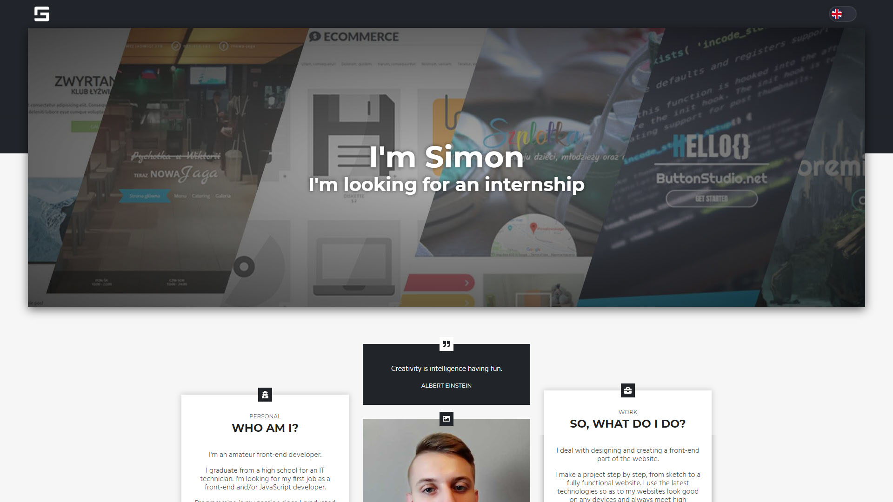

# szymonguzik.pl - portfolio

## My personal portfolio website

See [demo](https://szymonguzik.pl/) on [netlify.com](https://netlify.com)

Built using [GatsbyJS](https://github.com/Ghornon/gulp-automation) and [Gatsby's default starter](https://www.gatsbyjs.org/docs/gatsby-starters/).

#### Technologies used in the project:

-   [GatsbyJS](https://www.gatsbyjs.org/)
-   [React](https://reactjs.org/)
-   [GraphQL](https://graphql.org/)
-   [Sass](https://sass-lang.com/)
-   [fontawesome.io](http://fontawesome.io/)
-   [scroll-to-element](https://www.npmjs.com/package/scroll-to-element/)
-   [ESLint](https://eslint.org/)
-   [Prettier](https://prettier.io/)

## License

See the [LICENSE](LICENSE) file for license rights and limitations (MIT).

#### Icons

Icons used in project are from [fontawesome.io.](http://fontawesome.io) on [license CC](https://creativecommons.org/licenses/by/4.0/).

#### Photos

[Background photo](https://unsplash.com/photos/fDsCIIGdw9g) created by [
Ewan Robertson](https://unsplash.com/@ewan121)
